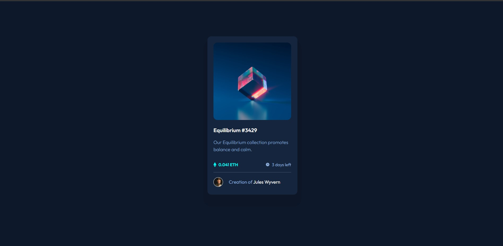
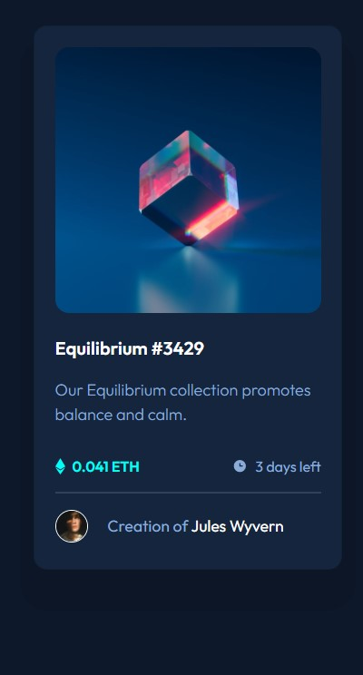

# Frontend Mentor - NFT preview card component solution

This is a solution to the [NFT preview card component challenge on Frontend Mentor](https://www.frontendmentor.io/challenges/nft-preview-card-component-SbdUL_w0U). Frontend Mentor challenges help you improve your coding skills by building realistic projects. 

## Table of contents

- [Overview](#overview)
  - [The challenge](#the-challenge)
  - [Screenshot](#screenshot)
  - [Links](#links)
- [My process](#my-process)
  - [Built with](#built-with)
  - [What I learned](#what-i-learned)
  - [Continued development](#continued-development)
  - [Useful resources](#useful-resources)
- [Author](#author)
- [Acknowledgments](#acknowledgments)

**Note: Delete this note and update the table of contents based on what sections you keep.**

## Overview

### The challenge

My users should be able to:

- View the optimal layout depending on their device's screen size
- See hover states for interactive elements

### Screenshot





### Links

- Solution URL: [Solution URL](https://github.com/SGautam1108/NFT-Card-Component)
- Live Site URL: [Live site](https://sgautam1108.github.io/NFT-Card-Component/)

## My process

The basic process of structuring, styling and finalizing.
Started with HTML to structure my component, and used Bootstrap for basic card elements.
Next with CSS for styling and took a few hours to narrow down the exact styling as provided in the challenge's design images.
The final task was adding the overlay for image to act as link and with various resources and referrals, right on target!

### Built with

- Semantic HTML5 markup
- CSS custom properties
- [Bootstrap](https://getbootstrap.com//) - For Grid and Card structure

### What I learned

The best part of this challenge was to revise the concepts I have learnt over past few weeks concerning HTML, CSS and bootstrap. A major mistake was to add bootstrap js bundle only leaving behind the main css bundle in header of html. This lead to a disaster (LOL), and i figured in an hour what actual blunder I had made. But after that, it was a smooth ride.

I had to add this-

```html
  <link href="https://cdn.jsdelivr.net/npm/bootstrap@5.1.3/dist/css/bootstrap.min.css" rel="stylesheet" integrity="sha384-1BmE4kWBq78iYhFldvKuhfTAU6auU8tT94WrHftjDbrCEXSU1oBoqyl2QvZ6jIW3" crossorigin="anonymous">
```

But I added this alone (T-T) -

```html
 <script script src="https://cdn.jsdelivr.net/npm/bootstrap@5.1.3/dist/js/bootstrap.bundle.min.js" integrity="sha384-ka7Sk0Gln4gmtz2MlQnikT1wXgYsOg+OMhuP+IlRH9sENBO0LRn5q+8nbTov4+1p" crossorigin="anonymous"></script>
```

The major obstacle was adding an overlay to the image of card for the hover effect. And I accomplished it by storing it in an anchor tag and pseudo elements!
```html
  <a href="#" class="card-img-link">
    
    
  </a>
```

### Continued development

In future, I will be reworking this project with basic flexbox and also with tailwindcss if possible. Also, it would be fun to add some cool effects on the card itself on hovering it!!

### Useful resources

- [Boostrap docs](https://getbootstrap.com/docs/5.1/getting-started/introduction/) - A Life Saviour.
- [Kevin Powell](https://www.youtube.com/channel/UCJZv4d5rbIKd4QHMPkcABCw) - Great CSS Ideas and frontend best practices tips


## Author

- LinkedIn - [Shaurya Gautam](https://www.linkedin.com/in/sgautam1108/)
- Frontend Mentor - [@SGautam1108](https://www.frontendmentor.io/profile/SGautam1108)
- CSSBattles.dev - [@SGautam1108](https://cssbattle.dev/player/sgautam1108)
- Github - [@SGautam1108](https://github.com/SGautam1108/)


## Acknowledgments

A Special thanks to Angela Yu, Course Instructor for "Full stack development" course at Udemy. Her course has been of a great help for me to start out with these projects on my own. Cheers to y'all!!
